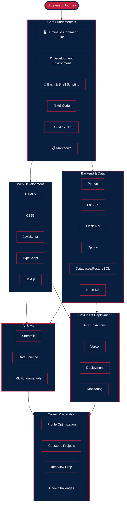

# Vets Who Code Web Curriculum
At **Vets Who Code**, we believe in the transformative power of practical, hands-on learning. Our curriculum is designed to equip veterans with in-demand technical skills and real-world knowledge, preparing them to excel in tech teams worldwide. 🖥️

With **12 modules** covering everything from foundational programming to deployment and job preparation, our program provides a comprehensive guide for breaking into and succeeding in the tech industry. Whether you're learning part-time or diving in full-time, we've structured the curriculum to fit your pace while emphasizing quality, impact, and inclusivity. 💪

---
## Why #VetsWhoCode?
- **Focused on tangible results**: Practical projects, collaborative exercises, and industry-aligned skills.
- **Tailored for veterans**: Support, mentorship, and strategies to overcome unique challenges.
- **Built by veterans for veterans**: Contributions from developers and industry leaders ensure relevance and rigor.

---
## Acknowledgments
We owe our success to the talented contributors who shaped this curriculum:
### Veteran Developers:
- Jerome Hardaway
- Schuster Braun
- Mike White
### Curriculum Reviewers:
- Brian Holt
- Kyle Shevlin
- Melanie Sumner
- Caree Youngman
- Ken Wheeler

---
## Curriculum Modules
Our program consists of the following 12 modules:
1. Core Fundamentals  
2. Web Fundamentals  
3. Scalable Programming Principles  
4. Next.js & TypeScript  
5. Postgres Databases with Neon  
6. Python Fundamentals  
7. FastAPI  
8. Streamlit for AI Applications  
9. DevOps with GitHub Actions & Vercel  
10. Flask (API Service Layer)  
11. Django Enterprise Framework  
12. Job Preparation  

---
## Curriculum Roadmap

### Interactive View

---
## Learning Outcomes
By completing this program, you will:
1. Gain a **solid foundation** in programming, web development, and scalable coding principles.  
2. Master industry tools like **Next.js**, **Postgres**, **Python**, and **FastAPI** for modern web applications.  
3. Build and deploy real-world projects using tools like **Vercel**, **GitHub Actions**, and **Docker**.  
4. Learn job-ready skills, including **resume crafting**, **mock interviews**, and **portfolio building**.  

---
## Get Started
Start your journey with **Vets Who Code** and transform your career today. You have the skills—we have the roadmap to your success. 🚀
